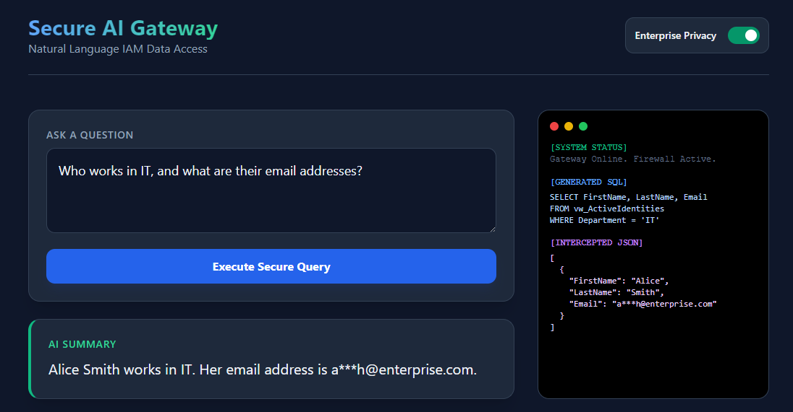
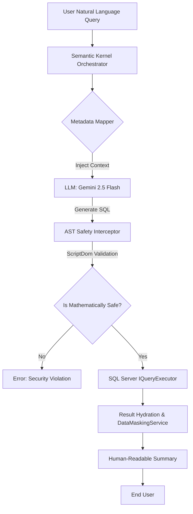

# SQL-to-Natural-Language: The Secure Enterprise Gateway

> **Enterprise-Grade AI Middleware.** This project demonstrates a production-ready "Secure Intelligence Layer" that bridges LLM reasoning with sensitive SQL data. It solves the three biggest hurdles to AI adoption in the enterprise: **Security, Privacy, and Accuracy**.

---

## 1. The Problem Statement (The "Why")
Most "Text-to-SQL" implementations are dangerous. They risk **SQL injection**, expose sensitive **PII (Personally Identifiable Information)**, and are prone to **hallucinations**. 

Having managed enterprise data at Traka (ASSA ABLOY) for 10 years as well as 5 years at Inchcape, I know that giving an LLM raw access to a production database is a non-starter. This project aims to solve that by placing a sophisticated engineering "buffer" between the AI and the Data.

## 2. The Architectural Solution (The "How")
This project utilizes a **Clean Architecture** approach to create a **Zero-Trust Intelligence Layer**.

* **The Semantic Map:** A `MetadataMapper` translates business terms into specific, read-only SQL views. It includes a data dictionary to prevent type hallucinations, such as mapping "Top Secret" to `ClearanceLevel = 3`.
* **Mathematical AST Validation:** Every AI-generated query is parsed into an **Abstract Syntax Tree (AST)** using `Microsoft.SqlServer.TransactSql.ScriptDom`. We use the Visitor pattern to mathematically prove the query is a safe `SELECT` statement before execution.
* **Zero-Allocation PII Masking:** A dedicated domain service scrubs sensitive data using `ReadOnlySpan<char>` and `string.Create` to ensure high-performance processing without Garbage Collection (GC) pressure.
* **Polly V8 Resilience:** Native integration with the Polly V8 resilience framework at the HTTP level ensures Gemini API transient faults (429/50x) are handled with professional exponential backoff.

---

## 🖼️ Live Demo: The Secure Gateway in Action

This project demonstrates a real-world execution of the secure AI middleware. The interface below showcases how the system coordinates intent mapping, data retrieval, and automated privacy masking.



#### **Technical Deep-Dive: What’s Happening?**

* **Dynamic Intent Mapping:** The **Semantic Kernel** orchestrator identifies the user's goal and provides the LLM with metadata for specific authorized views rather than the entire database schema.
* **Mathematical Safety Interception:** The generated T-SQL is converted to an AST. A `SecureViewVisitor` traverses the tree to ensure no unauthorized base tables are accessed, even through subqueries or joins.
* **Zero-Allocation Privacy:** As seen in the **Intercepted JSON** panel, emails are masked using `string.Create`. This zero-allocation approach is designed for high-throughput enterprise datasets.
* **Global Resilience:** The gateway utilizes the **Polly V8 Standard Resilience Handler**, wired directly to the `IHttpClientFactory`, to handle rate-limiting transparently.

---

## 3. Tech Stack
* **Runtime:** .NET 10
* **Architecture:** Clean Architecture (API, Core, Infrastructure)
* **Orchestration:** Microsoft Semantic Kernel
* **SQL Parser:** Microsoft.SqlServer.TransactSql.ScriptDom (AST Validation)
* **Database:** SQL Server 2022
* **AI Model:** Gemini 2.5 Flash
* **Resilience:** Polly V8 (Native .NET Resilience Pipelines)

## 4. Security "Moat" (The Senior Edge)
* **AST Defense-in-Depth:** Mathematical guarantee that only single-statement `SELECT` queries against authorized views can execute.
* **PII Redaction:** Performance-optimized `Span<T>` masking of sensitive fields at the C# Domain layer.
* **Read-Only Enforcement:** Strict AST node-type checking to block any `UPDATE`, `DELETE`, or `DROP` commands.
* **Schema Isolation:** The LLM only interacts with an abstracted Metadata layer (**SQL Views**), never the underlying physical tables.

---

## 🏗️ Technical Architecture

The system operates on a **Request-Validation-Execution** pipeline:



---

## 🚀 Getting Started

To run this gateway locally, ensure you have Docker Desktop and a Google Gemini API Key.

### Initial Setup

1.  **Clone the repository:**
    ```bash
    git clone [https://github.com/andyswain33/SQL-to-Natural-Language.git](https://github.com/andyswain33/SQL-to-Natural-Language.git)
    cd SQL-to-Natural-Language
    ```
2.  **Handle Secrets:**
    Copy the template environment file and add your actual Gemini API Key.
    ```bash
    cd AndysDataGateway
    cp template.env .env
    ```
3.  **Launch the Stack:**
    ```bash
    docker-compose up --build
    ```
4.  **Initialize the Database:**
    Run the automated setup script to seed the IAM schema and security views:
    ```powershell
    ./setup-db.ps1
    ```

---

## 🧠 Technical Challenges & Resolutions

#### **1. Handling API Rate Limiting (Polly V8)**
* **Challenge:** The Gemini Free Tier enforces strict rate limits. Manual retry logic is prone to thread exhaustion.
* **Resolution:** Configured the **Polly V8 Standard Resilience Handler** globally via the DI container. This provides a professional exponential backoff (2s, 4s, 8s) at the HTTP level without polluting the business orchestrator.

#### **2. Moving Beyond Regex for SQL Safety**
* **Challenge:** Regex word-boundary checking can be bypassed by malicious AI output using nested comments or hex-encoded characters.
* **Resolution:** Implemented `Microsoft.SqlServer.TransactSql.ScriptDom`. By parsing SQL into an AST, the system can mathematically prove a query is safe before execution.

#### **3. High-Performance PII Redaction**
* **Challenge:** Standard `string.Replace` and `Regex.Replace` on result sets of thousands of rows cause significant GC pressure.
* **Resolution:** Implemented a zero-allocation masking service using `ReadOnlySpan<char>` and `string.Create`, ensuring the application maintains enterprise-level throughput.

---

## 🗺️ Future Roadmap: Moving to Production

#### **1. Granular RBAC Integration**
* **Identity Mapping:** Integrating the gateway directly with an organization’s Active Directory or OIDC provider.
* **Contextual Permissions:** Dynamically filtering available metadata based on user claims to ensure "Principle of Least Privilege".

#### **2. Vector-Based Schema Discovery**
* **Scale:** In environments with thousands of tables, hardcoded mapping fails.
* **Resolution:** Moving the `MetadataMapper` to a Vector Database (RAG) to dynamically find relevant views based on semantic similarity.

#### **3. Advanced Audit & OpenTelemetry**
* **Compliance:** Implementing a dedicated OpenTelemetry sink to log every AST-validated query and its resulting data for security auditing.

---

## 📂 Project Structure

```text
AndysDataGateway/
├── src/
│   ├── Gateway.API/            # Thin Controllers & Interactive Dashboard
│   ├── Gateway.Core/           # Interfaces, Orchestration, & Masking Domain
│   └── Gateway.Infrastructure/ # SQL Execution & ScriptDom AST Interceptors
├── Gateway.Tests/              # xUnit Suite for AST & Masking logic
├── setup-db.ps1                # Database Initialization Script
└── SampleSchema.sql            # Enterprise IAM Schema & Seed Data
```

---
*Developed by Andrew Swain — [andyswain.dev](https://www.andyswain.dev)*