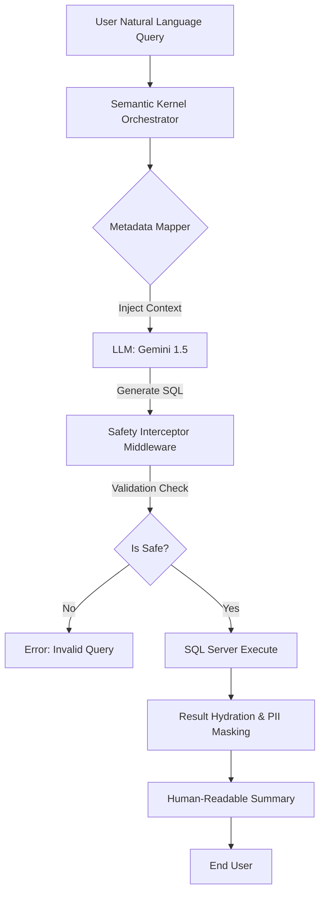

# SQL-to-Natural-Language: The Secure Enterprise Gateway

> **Enterprise-Grade AI Middleware.** This project demonstrates how to safely bridge LLM intelligence with sensitive SQL data. It solves the three biggest hurdles to AI adoption in the enterprise: **Security, Privacy, and Accuracy**.

---

## 1. The Problem Statement (The "Why")
Most "Text-to-SQL" implementations are dangerous. They risk **SQL injection**, expose sensitive **PII (Personally Identifiable Information)**, and are prone to **hallucinations**. 

Having managed enterprise data at Traka (ASSA ABLOY) for 20 years, I know that giving an LLM raw access to a production database is a non-starter. This project aims to solve that by placing a sophisticated engineering "buffer" between the AI and the Data.

## 2. The Architectural Solution (The "How")
This project demonstrates a **Secure Intelligence Layer**. Instead of giving the AI the whole schema, I built a **Metadata Proxy**.

* **The Semantic Map:** A C# layer that translates business terms (e.g., "Active Users") into specific, read-only SQL views.
* **The Validation Engine:** Every AI-generated query is parsed and validated against a white-list of allowed tables and operations before execution.
* **Agentic Orchestration:** Utilizing **Microsoft Semantic Kernel** to handle the reasoning loop, ensuring the system stays within defined business logic bounds.

## 3. Tech Stack
* **Runtime:** .NET 10
* **Orchestration:** Microsoft Semantic Kernel
* **Database:** SQL Server 2022 (Physical Access Control / IAM Schema)
* **AI Model:** Gemini 1.5 Flash (via Google AI SDK)
* **Resilience:** Polly (Exponential Backoff & Retries)

## 4. Security "Moat" (The Senior Edge)
* **PII Masking:** Automatic detection and scrubbing of sensitive data (like emails) in the query results using C# logic before the LLM summarizes the answer.
* **Read-Only Enforcement:** Middleware-level blocking of any `UPDATE`, `DELETE`, or `DROP` commands.
* **Resilience Policy:** Built-in **Polly** retry logic to handle Gemini API rate-limiting (429 errors), ensuring high availability.
* **Schema Isolation:** The LLM only interacts with an abstracted Metadata layer (**SQL Views**), never the underlying physical tables.

---

## 🚀 Getting Started

To run this gateway locally, ensure you have Docker Desktop (with WSL 2 backend recommended) and a Google Gemini API Key.

### Initial Setup

1. **Clone the repository:**
   ```bash
   git clone [https://github.com/your-username/SQL-to-Natural-Language.git](https://github.com/your-username/SQL-to-Natural-Language.git)
   cd SQL-to-Natural-Language
   ```

2. **Handle Secrets:**
   Copy the template environment file and add your actual Gemini API Key. (The `.env` file is explicitly ignored by Git to prevent credential leaks).
   ```bash
   cd AndysDataGateway
   cp template.env .env
   # Open .env and add your GEMINI_API_KEY
   ```

3. **Launch the Stack:**
   The entire stack is containerized for a consistent, zero-config experience.
   ```bash
   docker-compose up --build
   ```

4. **Initialize & Seed the Database:**
   Once the logs show SQL Server is ready, open a second terminal in the `AndysDataGateway` folder and run the automated setup script to seed the IAM schema and security views:
   ```powershell
   ./setup-db.ps1
   ```
   *Access the Interactive Dashboard at `http://localhost:8080/index.html`.*

---

## 🏗️ Technical Architecture

The system operates on a **Request-Validation-Execution** pipeline:



---

## 🧠 Technical Challenges & Resolutions

#### **1. Handling API Rate Limiting (429 Errors)**
* **Challenge:** The Gemini Free Tier enforces strict rate limits. During rapid testing, the API would return `429 Too Many Requests`, crashing the request flow.
* **Resolution:** Implemented an **Exponential Backoff** strategy using the **Polly** library. The orchestrator now detects 429 errors and automatically retries the request with increasing delays (2s, 4s, 8s), ensuring a seamless user experience.

#### **2. SQL Server Identity & View Seeding**
* **Challenge:** Manual table creation in Dockerized SQL Server is prone to timing issues and "Invalid Object Name" errors during the API boot phase.
* **Resolution:** Developed an idempotent `SampleSchema.sql` using `IF NOT EXISTS` and `DROP` logic, paired with a `setup-db.ps1` automation script. This ensures the database, secure views, and sample identities are correctly initialized every time.

#### **3. SQL Injection & Defense-in-Depth**
* **Challenge:** LLMs can be manipulated into generating destructive SQL commands.
* **Resolution:**
    * **The Semantic Moat:** The AI is only provided metadata for read-only Views, not base tables.
    * **Regex Firewall:** A `SqlSafetyInterceptor` blocks non-`SELECT` commands using word-boundary regex.
    * **AST Roadmap:** For production, the roadmap involves a full Abstract Syntax Tree (AST) parser via `Microsoft.SqlServer.TransactSql.ScriptDom`.

---

## 📝 Operational Troubleshooting

#### **1. API Rate Limiting (429 Errors)**
* **Issue:** The system returns a `429 Too Many Requests` error in the Docker logs or the interactive dashboard.
* **Resolution:** This is a byproduct of the Gemini Free Tier limits. The Gateway is architected to handle this via a **Polly Resilience Policy**, which automatically retries the request with an exponential backoff (2s, 4s, 8s). 
* **Note:** If retries continue to fail, you have likely reached the **Daily Quota (RPD)**. Access will automatically restore at the start of the next 24-hour cycle (typically 5:00 PM GMT). To minimize these errors during a demo, avoid rapid-fire queries and allow the AI response to complete before sending a new request.

---## 📂 Project Structure

```text
AndysDataGateway/
├── src/
│   ├── Gateway.API/            # .NET 10 Web API & Static Dashboard
│   ├── Gateway.Core/           # Orchestration, Mapping & Polly Policies
│   └── Gateway.Infrastructure/ # SQL Data Access & Safety Interceptors
├── setup-db.ps1                # Automated Database Initialization Script
├── docker-compose.yml          # Container Orchestration
└── SampleSchema.sql            # Enterprise IAM Schema & Seed Data
```

---
*Developed by Andrew Swain — [andyswain.dev](https://www.andyswain.dev)*